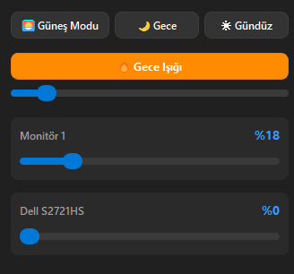

# ☀️ Windows Parlaklık Kontrolü (System Tray App)


Windows işletim sistemleri için geliştirilmiş; çoklu monitör desteğine sahip, modern Windows 11 koyu temalı ve **%100 Çevrimdışı Güneş Yüksekliği (NOAA Solar Calculation)** algoritması içeren şık bir sistem tepsisi (system tray) parlaklık kontrol uygulaması.

---

## 📸 Arayüz Ekran Görüntüsü



---

## ✨ Öne Çıkan Özellikler

- ⚡ **Asenkron Donanım Thread'i (`QThread`)**: Tüm DDC/CI monitör yazma işlemleri arka planda çalışır. Arayüz yavaş monitörlerde bile 0ms gecikmeyle 60 FPS akıcı kalır.
- 🖱️ **Fare Tekerleği İle Hızlı Kontrol**: Sistem tepsisindeki simge üzerindeyken fare tekerleği çevrilerek penceresiz parlaklık artırılıp azaltılabilir (%5 adımlarla).
- 🔒 **Tekil Çalışma Kilidi (`QLocalServer`)**: Uygulama açıkken tekrar çift tıklandığında ikinci bir süreç açılmaz, mevcut pencere öne getirilir.
- 🌅 **Çevrimdışı Güneş Modu**: Dış API veya internet gerektirmeden, astronomik Güneş Yüksekliği ($\alpha$) formülü ile gün boyunca parlaklığı yumuşak sinüs eğrisi üzerinden otomatik ayarlar.
- 🖥️ **Çoklu Monitör Desteği**: Sistemdeki tüm bağlı ekranları (*Dell, Generic Monitor, laptop paneli vb.*) otomatik algılar ve eşzamanlı kontrol sağlar.
- 🌙 **Hazır Profil Butonları**: Güneş Modu, Gece Modu (%0) ve Gündüz Modu (%100) arasında tek tıkla geçiş.
- 📌 **Dinamik Tepsi (Tray) Tooltip**: Fare simge üzerindeyken anlık aktif modu ve monitörlerin % parlaklıklarını liste halinde gösterir.
- 🔄 **Windows Başlangıç Kaydı**: Sistem başlangıcına ekleme/çıkarma opsiyonu (Windows Registry `HKCU` entegrasyonu).

---

## 🛠️ Gereksinimler ve Kurulum

### 1. Python Bağımlılıkları
```bash
pip install PyQt5 screen-brightness-control
```

---

## 🚀 Çalıştırma

```bash
pythonw brightness.pyw
```

---

## 📄 Lisans

Bu proje **MIT Lisansı** altında serbestçe kullanılabilir ve geliştirilebilir.
